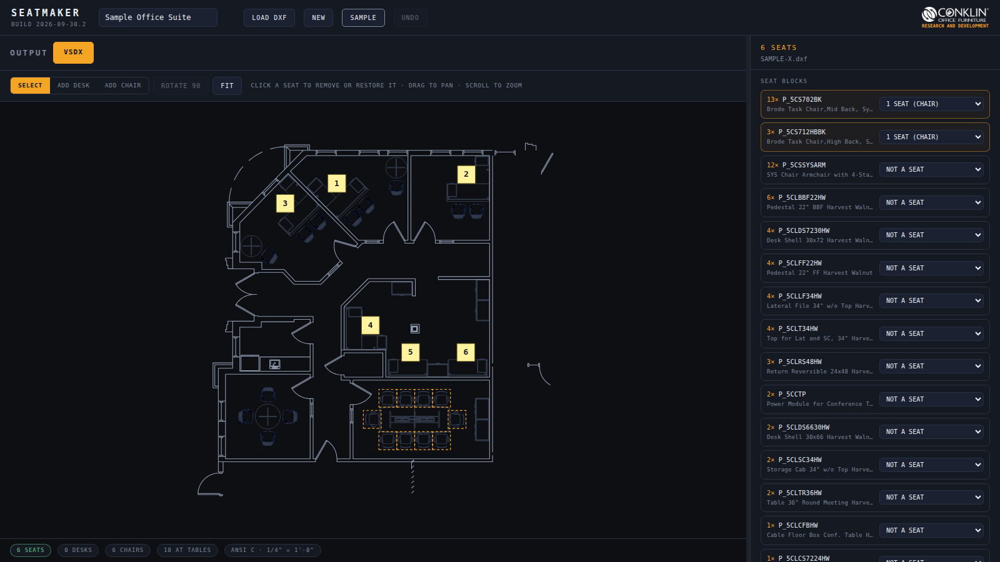
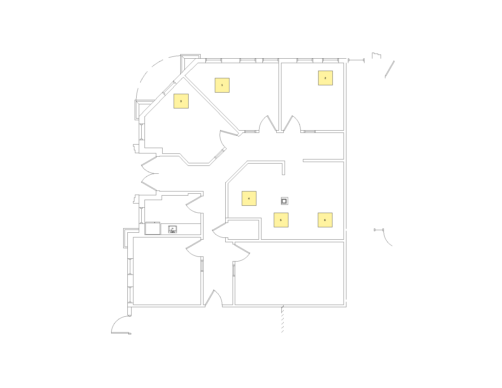

# SEATMAKER

CONKLIN OFFICE FURNITURE - RESEARCH AND DEVELOPMENT

# SEATMAKER

Turns a CAP / AutoCAD floor plan into a Visio seating plan for HR. Drop in the floor's DXF and SEATMAKER finds every seat, draws a clean floor plan with room names, and numbers the seats. Remove or add seats with a click, then download a Visio file where the floor plan is locked and every seat is its own shape, ready to renumber or color by department. The drawing is read in the browser and never leaves the computer.

OUTPUT IN VSDX FORMAT

LAUNCH — https://wesprojects.github.io/SEATMAKER/

README — https://github.com/wesprojects/SEATMAKER

## Sample

Click **SAMPLE** in the app to load `SAMPLE-X`, a small office suite drawn in CAP with Conklin Harvest Walnut casegoods. It is built into the app, so it works offline too. The drawing is also in this repository at [`samples/SAMPLE-X.dxf`](samples/SAMPLE-X.dxf).

SAMPLE-X has 16 Brode task chairs. SEATMAKER makes **6 seats** from them: one in each of the three private offices across the top, and three in the shared office in the middle. The other 10 are pulled up to the 10' knife-edge conference table, so they are meeting seats, not assignable ones. They show dashed in orange and stay out of the Visio file unless you click one. The SYS guest armchairs and the round meeting tables are furniture, not seats.

The Visio file it exports, on ANSI C at 1/4" = 1'-0":

## Usage

1. In AutoCAD, SAVEAS **AutoCAD 2013 DXF**. Don't flatten, explode or purge first. SEATMAKER reads the CAP blocks as they are.
2. Open SEATMAKER and drop the DXF on the page, or use LOAD DXF.
3. Check the seats. Click a seat to remove it and click again to bring it back. ADD DESK and ADD CHAIR place seats by hand. UNDO steps back.
4. Type the floor name, pick the sheet, and click **VSDX**.

Runs in a current desktop browser. Chrome is recommended. It opens from GitHub Pages or straight from a downloaded `index.html`. Large drawings (80 MB) take a few seconds to read.

## What it finds

| Source | Seats |
|---|---|
| Back-to-back benching block, any manufacturer | 2 per block |
| Single desk, bench or worksurface block, 48" or longer | 1 per block |
| CAP blocks described as a task chair | 1 per chair |
| Task chairs at a meeting or conference table | left out and shown dashed, click to add |
| Exploded desk linework on a DESK or BENCH layer, in 60" multiples, 30–35" deep | 1 per 60" |
| Any other furniture block | set it to CHAIR, DESK or 2 SEATS in the SEAT BLOCKS list |

Desks and benching are recognized by what they are, not by product line: the CAP description or block name says bench, spanner, desk, workstation or worksurface. Returns, pedestals, files, storage, screens, trays and other parts don't count. A block is back to back when it has a spine line across its middle with desk depth (20–40") on each side. A desk with a task chair at it counts once, as the chair.

A chair is at a table when its center is within 20" of a block whose CAP description is a table (meeting, conference, knife edge, round and so on). Coffee and end tables, table bases and tops, and power modules don't count.

Loose desk-layer pieces that aren't a desk shape (such as 36 x 67 end pieces) are listed but not counted.

## Drawing handling

- **Clipped blocks (XCLIP).** A clipped core plan is trimmed to what AutoCAD shows, so other floors in the base building block don't come through.
- **Nested blocks.** Seats are found at any depth, including a whole floor wrapped in one block and chairs inside copied groups.
- **3D solids.** CAP worksurfaces and pedestals that are solid-only are ignored. The seat comes from the desk or chair block instead.
- **Hidden layers.** Layers that are off or frozen are skipped.
- **Plan layers.** Walls, doors, glazing, columns, stairs, core and fixtures go on the plan. Furniture, annotation, dimensions and hatches stay off it.

## Visio file

- One page, named from the floor name, on ANSI C 22 x 17, ARCH D 36 x 24 or Tabloid 17 x 11 at the largest architectural scale that fits: 1/2", 3/8", 1/4", 3/16", 1/8", 3/32" or 1/16" = 1'-0". A full floor lands at 1/8" on ANSI C. SAMPLE-X lands at 1/4".
- Layer **Floor Plan** is locked. Layer **Seats** holds one rectangle per seat with its number as the text.
- Numbering puts office chairs first, top to bottom, then each bench row from the top, left to right, front and back desk as a pair. FIRST SEAT NUMBER sets where it starts.

## Files

- `index.html` — the whole app in one file, with SAMPLE-X built in. Opens from disk or GitHub Pages.
- `src/engine.js` — DXF reader, block and clip flattening, seat detection, numbering, VSDX and ZIP writer. No page code, so it also runs in Node.
- `src/page.html` — the interface. `src/brand.html` — the Conklin header lockup.
- `samples/SAMPLE-X.dxf` — the sample drawing.
- `docs/` — the README images, made from SAMPLE-X.
- `build.py` — assembles `index.html` and builds the sample in: `python3 build.py YYYY-MM-DD.N`.
- `test/test.js` — reads a DXF, writes the VSDX, and checks the seat count: `node test/test.js samples/SAMPLE-X.dxf 6`. Client drawings are not kept in this repository.

## Limits

- DXF only. DWG is a closed format the browser can't read.
- Seat outlines are rectangles. Curved or L-shaped desks get their overall footprint.
- Room names come from the A-AREA-IDEN layer. SAMPLE-X has none, so its plan has no room names. Tags placed outside the building in the drawing land outside it on the plan too.
